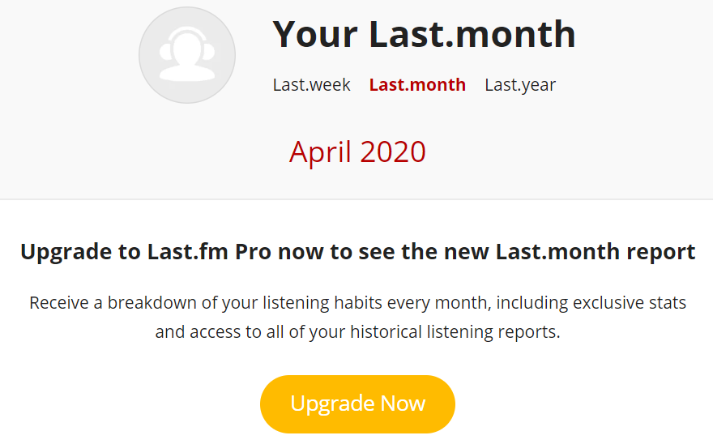

# PERSONAL MUSIC LISTENING REPORT

> **NOTE**: Access via [nbviewer](https://nbviewer.jupyter.org/github/tomytjandra/lastfm-music-listening-report/blob/master/Personal%20Music%20Listening%20Report.ipynb#Visualization) if the notebook cannot be rendered on Github.

## About
In the notebook of this repository, we will analyze my music listening pattern since the beginning of year 2020. The data of my playlist history will be fetched from [Last.fm API](https://www.last.fm/api/). [Last.fm](https://www.last.fm/) is an online music service that lets us stream our favorite music for free while offering great listening, watching, and sharing features. What makes last.fm unique from the other services is their **scrobbling system**. Every time we play a track from other music applications (Spotify, Google Play Music, YouTube Music, etc), the track is added, or scrobbled, to our Last.fm account. This allows us to share our musical tastes, make and receive recommendations from other users, and create custom radio stations.

Last.fm also provides us a quite decent [weekly music listening report](https://www.last.fm/user/tomythovens/listening-report/week). But when we want to see monthly and yearly, unwanted things happened:

Yes, they will provide the report if we upgrade our account to Last.fm Pro :( Therefore, how about we create my own customizable visualization by utilizing Python packages for free?

## What's inside the notebook?
- Data collection from Spotify and Last.fm API
- Various data cleansing steps
- Time series visualization (hourly, daily, and weekly)
- Top tracks and artists visualization

## Ideas for future works
- Enhance and add more visualization
- Instead of using a static plot, we can re-create the plot to be interactive using `plotly`
- Make a personal music listening dashboard
- Re-visit this notebook at the end of 2020 and update the insight to get a complete report
- Publish an article of "Personal Music Wrapped 2020"